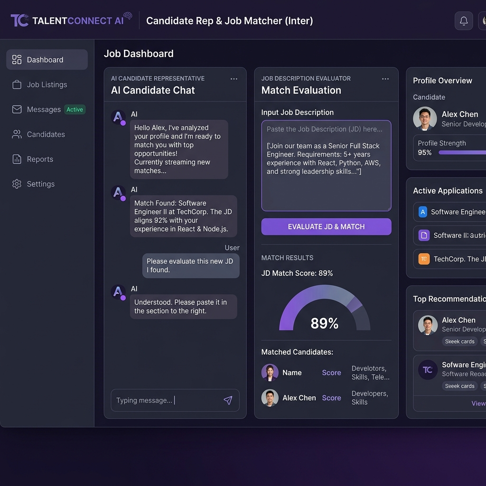

# 🤖 AI Representative & Job Matcher

[](https://fastapi.tiangolo.com/)
[](https://react.dev/)
[](https://vitejs.dev/)
[](https://groq.com/)
[](https://render.com/)
[](https://vercel.com/)

An interactive AI-powered representative portfolio application. This project features an AI persona grounded on professional profile data (`profile.json`) powered by **FastAPI**, **Groq (LLaMA 3.3 70B)**, and **React + Vite**. It answers questions about candidate skills and evaluates candidate suitability directly against pasted Job Descriptions in real-time streaming responses.



---

## 🚀 Live Demo & Links

- 🌐 **Live Website (Frontend):** [Deploy on Vercel](https://vercel.com) *(Update with your Vercel URL)*
- ⚡ **Live API (Backend):** [Deployed on Render](https://render.com) *(Update with your Render URL)*
- 📦 **GitHub Repository:** [ai-portfolio-backend](https://github.com/anishsingh-collab/ai-portfolio-backend)

---

## ✨ Features

- 💬 **Real-time AI Response Streaming:** Fast, low-latency response generation using Groq's `llama-3.3-70b-versatile` model.
- 📋 **HR Job Description Evaluation Mode:** Paste any Job Description to get an instant evaluation on candidate suitability, strengths, skill gaps, and interview recommendations.
- 🎯 **Grounded AI Persona:** Strictly answers using structured profile JSON with anti-hallucination rules.
- 🎨 **Modern Dark UI:** Responsive design built with React, Vite, CSS variables, and clean micro-interactions.

---

## 🛠️ Tech Stack

### Backend
- **Framework:** FastAPI (Python)
- **AI Inference Engine:** Groq API (`llama-3.3-70b-versatile`)
- **Server:** Uvicorn ASGI
- **Deployment:** Render (Free Web Service)

### Frontend
- **Framework:** React 19 + Vite
- **Styling:** Custom Modern CSS
- **Deployment:** Vercel

---

## 📁 Repository Structure

```text
ai_portfolio/
├── AI_PORTFOLIO/            # FastAPI Backend
│   ├── backend.py           # Core FastAPI server & Groq streaming endpoint
│   ├── profile.json         # Candidate background & skills data
│   ├── pyproject.toml       # Dependencies manifest
│   └── requirements.txt     # Python package requirements
├── frontend/                # React Frontend App
│   ├── src/                 # React UI components & App styling
│   ├── package.json         # Node dependencies
│   └── vite.config.js       # Vite configuration
├── preview.png              # README Screenshot preview
├── requirements.txt         # Root fallback requirements
└── .gitignore               # Excludes secrets & node_modules
```

---

## ⚙️ Local Development Setup

### 1. Clone the repository
```bash
git clone https://github.com/anishsingh-collab/ai-portfolio-backend.git
cd ai-portfolio-backend
```

### 2. Backend Setup
```bash
cd AI_PORTFOLIO

# Create virtual environment
python -m venv .venv
source .venv/bin/activate  # On Windows: .venv\Scripts\activate

# Install dependencies
pip install -r requirements.txt

# Create .env file with your Groq API key
echo "GROQ_API_KEY=your_groq_api_key_here" > .env

# Run FastAPI backend
uvicorn backend:app --reload --port 8000
```
*Backend runs on `http://127.0.0.1:8000`*

### 3. Frontend Setup
```bash
cd ../frontend

# Install dependencies
npm install

# Start Vite dev server
npm run dev
```
*Frontend runs on `http://localhost:5173`*

---

## 🛡️ License

Distributed under the MIT License. See `LICENSE` for more information.
